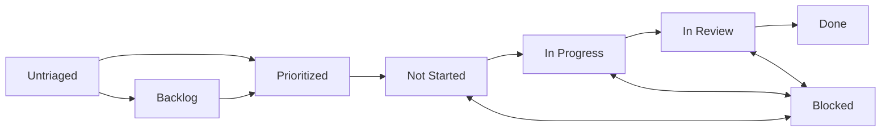

<!-- META
title: Types of Contributions
description: Guide to contribution types and expectations for CAIRA.
author: CAIRA Team
ms.date: 08/18/2025
ms.topic: guide
estimated_reading_time: 6
keywords:
    - contributions
    - community
    - documentation
    - code
    - issue management
    - review process
    - CAIRA
-->

# Types of Contributions

CAIRA welcomes contributions of all types and skill levels. This guide outlines the different ways you can contribute.

## Issue States

We manage contributions with a backlog, and we manage that backlog with issues of various types which transition between various states.

Whatever the type of issue, the flow for how we manage them will look the same.

- `Untriaged` - Default for new issues when being made by anybody.
- `Backlog` - Managed by team maintainer. This reflects that the team has chosen to approve but not prioritize the issue.
- `Prioritized` - Managed by team maintainer. This reflects that the team has chosen to approve the issue and prioritize it.
- `Not Started` - Manually assigned during sprint planning, when an issue is brought into a sprint.
- `In Progress` - Managed by the issue owner to reflect work has begun.
- `In Review` - Managed by the issue owner to reflect that a PR is open.
- `Done` - Managed by GitHub. Issues will automatically be moved to Done when the associated PR is merged.
- `Blocked` - Any issue may move in or out of Blocked state depending on if it depends on some other issue to be complete first.

## Examples

- Documentation Improvements
- Bug Reports
- Usage Examples
- Bug Fixes
- New configurations

## Contribution Quality Standards

### All Contributions

- **Clear communication** - Explain what you're doing and why
- **Follow project conventions** - Use existing patterns and styles
- **Include appropriate tests** - Verify your changes work as expected
- **Update documentation** - Keep docs in sync with code changes
- **Responsive to feedback** - Engage constructively in code reviews

### Code Contributions

- **Security-first approach** - Follow Microsoft Cloud Security Benchmark
- **Performance considerations** - Optimize for Azure deployment patterns
- **Maintainability** - Write clear, well-commented code
- **Compliance-ready** - Consider regulatory requirements

### Documentation Contributions

- **Accurate information** - Verify all technical details
- **Clear writing style** - Use simple, direct language
- **Practical examples** - Include working code samples
- **Consistent formatting** - Follow existing documentation patterns
- **Accessible content** - Consider different skill levels

## Community Support

### Getting Help

- **GitHub Discussions** - Ask questions and share ideas
- **Issue comments** - Get help with specific contributions
- **Documentation** - Check existing guides and examples
- **Code examples** - Look at existing implementations

---

Ready to contribute? Choose a type that matches your skills and interests, then follow our [Development Workflow](development_workflow.md) to get started!
