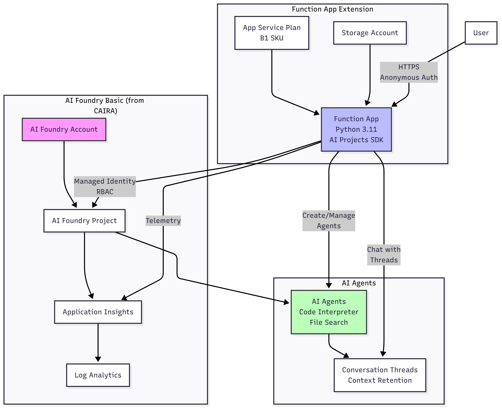
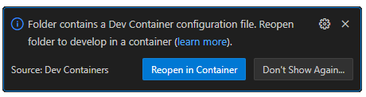
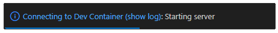

# AI Foundry Basic with Azure Function Integration - Implementation Guide

> **Educational Guide**: This implementation guide is designed for learning and experimentation. Some security features (like function authentication) are simplified for educational clarity. Production deployments should follow Azure security best practices.

## Overview

This guide demonstrates how to use the CAIRA `foundry_basic` reference architecture with Azure Functions to enable serverless AI agent capabilities. The solution builds upon the existing foundry_basic pattern and adds Azure Functions for serverless AI integration using Azure AI Foundry Projects SDK.

## Architecture Components



- **Azure AI Foundry**: AI services and project management (via foundry_basic module)
- **Azure AI Project**: Organized workspace for AI agents (via foundry_basic module)
- **Azure Function App**: Serverless compute with system-assigned managed identity
- **Application Insights**: Monitoring and diagnostics (via foundry_basic module)
- **Log Analytics**: Centralized logging (via foundry_basic module)

## Project Structure

The implementation consists of:

- **function-app/** - Azure Function application code using AI Projects SDK
- **terraform/** - Infrastructure as Code for the function layer
- **scripts/** - Automation and configuration scripts
- **tests/** - Unit and integration tests

## Key Implementation Details

### Azure AI Foundry Integration

The function app uses the **Azure AI Projects SDK** to:

- Create and manage AI agents with tools (code interpreter, file search)
- Maintain conversation threads for context retention
- Connect to AI Foundry projects using managed identity authentication

### Authentication Method

- **DefaultAzureCredential** for seamless authentication
- **System-assigned Managed Identity** in Azure
- **RBAC roles assigned via Terraform** - The Terraform configuration explicitly creates role assignments for the Function App's managed identity to access AI Foundry and storage resources

## Prerequisites

### Required Tools

- [Azure CLI](https://learn.microsoft.com/en-us/cli/azure/install-azure-cli) (version 2.50+)
- [Terraform](https://developer.hashicorp.com/terraform) (version 1.13+)
- [Azure Functions Core Tools](https://learn.microsoft.com/en-us/azure/azure-functions/functions-run-local) (version 4.x)
- [Python](https://www.python.org/downloads/) (version 3.11+)

### Azure Requirements

- Active Azure subscription with sufficient permissions
- App Service Plan quota in target region (B1 tier or higher)
- Azure AI Foundry service availability in your region

## Quick Start

### (Optional) VS Code Development Container

The recommended way to engage with this sample is through a [development container using VS Code](https://code.visualstudio.com/docs/devcontainers/containers):

1. Ensure that you have Docker configured. The easiest way is to install Docker Desktop locally, but see other options at the [Development Container documentation](https://code.visualstudio.com/docs/devcontainers/containers#_system-requirements).
1. Install [Visual Studio Code](https://code.visualstudio.com/).
1. Install the [Dev Containers extension](https://marketplace.visualstudio.com/items?itemName=ms-vscode-remote.remote-containers).
1. Clone the CAIRA repo using your method of choice.
1. Open the project in VS Code.
1. Assuming the Dev Containers extension is set up correctly, you should see a popup asking you if you would like to open the project in a dev container:

    

    Choose "Reopen in Container".
    - If you do not get the popup, you can instead click on the Dev Container extension in the bottom-left of the window, which will open a dropdown at the top of the window with a "Reopen in Container" option.

1. The first time you open the dev container, it will take a while to load and build all the configured settings. Once it has already been created, it will load more quickly in the future. In both cases there should be a notification that it is connecting, with an option to show logs; clicking on that notification will open a terminal showing all the configuration happening.

    

1. In the VS Code menu, click Terminal -> New Terminal to open a terminal within the container.
1. Install Python 3.11 and Azure Functions Core Tools:

    ```bash
    # Ensure Python 3.11 is installed (required for function app compatibility)
    sudo apt update
    sudo apt install -y python3.11 python3.11-venv python3.11-dev

    # Detect architecture and install appropriate Azure Functions Core Tools
    ARCH=$(uname -m)
    echo "Detected architecture: $ARCH"

    cd /tmp

    if [ "$ARCH" = "aarch64" ] || [ "$ARCH" = "arm64" ]; then
        echo "Installing Azure Functions Core Tools for ARM64 (Apple Silicon)..."
        wget https://github.com/Azure/azure-functions-core-tools/releases/download/4.3.0-preview1/Azure.Functions.Cli.linux-arm64.4.3.0-preview1.zip
        sudo unzip -d /opt/azure-functions-cli Azure.Functions.Cli.linux-arm64.4.3.0-preview1.zip
        rm Azure.Functions.Cli.linux-arm64.4.3.0-preview1.zip
    else
        echo "Installing Azure Functions Core Tools for x64 (Intel/AMD)..."
        wget https://github.com/Azure/azure-functions-core-tools/releases/download/4.0.5858/Azure.Functions.Cli.linux-x64.4.0.5858.zip
        sudo unzip -d /opt/azure-functions-cli Azure.Functions.Cli.linux-x64.4.0.5858.zip
        rm Azure.Functions.Cli.linux-x64.4.0.5858.zip
    fi

    # Set permissions and create symlinks (common for both architectures)
    sudo chmod +x /opt/azure-functions-cli/func /opt/azure-functions-cli/gozip
    sudo ln -sf /opt/azure-functions-cli/func /usr/local/bin/func
    sudo ln -sf /opt/azure-functions-cli/gozip /usr/local/bin/gozip

    # Verify installation
    func --version
    ```

### 1. Clone and Setup

Navigate to this guide's directory:

```bash
cd guides/implement_ai_foundry_basic_with_azure_function_integration
```

### 2. Login to Azure

```bash
az login
az account set --subscription <your-subscription-id>

# Make subscription ID available to terraform providers as environment variable
export ARM_SUBSCRIPTION_ID=$(az account show --query id -o tsv)
```

## Deployment Steps

### Step 1: Deploy Foundry Basic (if not already deployed)

First, deploy the foundry_basic reference architecture:

```bash
cd ../../reference_architectures/foundry_basic
terraform init
terraform apply
```

After deployment, capture the outputs you'll need:

```bash
# Save outputs for the function layer
RG_NAME=$(terraform output -raw resource_group_name)
AI_FOUNDRY_NAME=$(terraform output -raw ai_foundry_name)
AI_FOUNDRY_ID=$(terraform output -raw ai_foundry_id)
AI_PROJECT_ID=$(terraform output -raw ai_foundry_project_id)
AI_PROJECT_NAME=$(terraform output -raw ai_foundry_project_name)
APPINSIGHTS_ID=$(terraform output -raw application_insights_id)
LOG_WORKSPACE_ID=$(terraform output -raw log_analytics_workspace_id)

# Extract Application Insights name from its ID
APPINSIGHTS_NAME=${APPINSIGHTS_ID##*/}
```

### Step 2: Configure Function Layer Variables

Navigate to the function integration terraform directory and create your configuration:

```bash
cd ../../guides/implement_ai_foundry_basic_with_azure_function_integration/terraform
```

Create `terraform.tfvars` using the outputs from Step 1:

```bash
# Create terraform.tfvars with the captured values
cat > terraform.tfvars <<EOF
# Outputs from foundry_basic deployment
foundry_resource_group_name        = "$RG_NAME"
foundry_ai_foundry_name            = "$AI_FOUNDRY_NAME"
foundry_ai_foundry_id              = "$AI_FOUNDRY_ID"
foundry_ai_foundry_project_id      = "$AI_PROJECT_ID"
foundry_ai_foundry_project_name    = "$AI_PROJECT_NAME"
foundry_application_insights_name  = "$APPINSIGHTS_NAME"
foundry_log_analytics_workspace_id = "$LOG_WORKSPACE_ID"

# Function-specific configuration
project_name      = "ai-integration"
function_sku_size = "B1"
python_version    = "3.11"

tags = {
  Environment = "dev"
  Project     = "AI-Functions"
}
EOF

echo "✅ terraform.tfvars created with outputs from foundry_basic"
```

### Step 3: Deploy Function Infrastructure

Deploy the function infrastructure with Terraform. This will:

- Create a Function App with system-assigned managed identity
- Create a storage account for the Function App
- Configure all necessary RBAC role assignments:
  - Cognitive Services User on AI Foundry
- Set up Application Insights integration
- Configure the Function App with the AI Foundry endpoint

```bash
terraform init
terraform apply
```

The Terraform configuration handles:

- Assigns the managed identity proper roles to access AI Foundry Project
- Configures the Function App settings with the correct AI Foundry endpoint
- Sets up authentication using managed identity (no keys required)

### Step 4: Deploy Function Code

```bash
cd ../function-app

# Get the Function App name from Terraform output
FUNCTION_APP_NAME=$(cd ../terraform && terraform output -raw function_app_name)

# Deploy the Python function code
func azure functionapp publish $FUNCTION_APP_NAME --python --build remote
```

The `--build remote` flag ensures dependencies are built in Azure's environment, which is crucial for Python functions.

### Step 5: Verify Deployment

```bash
# Return to terraform directory
cd ../terraform

# Test health endpoint
curl $(terraform output -raw function_app_url)/api/health | jq .

# Expected response should show:
# - "status": "healthy"
# - "ai_foundry": { "client_initialized": true }
# - Agent information if any exist
```

## Function Endpoints

The implementation provides three streamlined endpoints for all agent operations:

### 1. Health Check (`/api/health`)

- **Method**: GET
- **Auth**: Anonymous
- **Purpose**: Verifies Function App and AI Foundry connectivity
- **Response**: JSON with configuration and connection status

### 2. Agent Operations (`/api/agent`)

- **Method**: POST
- **Auth**: Anonymous
- **Purpose**: Unified endpoint for all agent operations
- **Request Body**:

  ```json
  {
    "action": "create|chat|list|delete|code-interpreter",
    // Additional parameters based on action
  }
  ```

**Available Actions:**

- **create**: Create a new AI agent

  ```json
  {
    "action": "create",
    "name": "assistant-name",
    "instructions": "You are a helpful assistant",
    "model": "gpt-4",
    "enable_code_interpreter": true,
    "enable_file_search": false
  }
  ```

- **chat**: Have conversations with AI agents

  ```json
  {
    "action": "chat",
    "message": "Your message here",
    "thread_id": "optional-thread-id"
  }
  ```

- **list**: List all agents in the project

  ```json
  {
    "action": "list"
  }
  ```

- **delete**: Delete an agent by ID

  ```json
  {
    "action": "delete",
    "agent_id": "agent-id-to-delete"
  }
  ```

- **code-interpreter**: Demonstrate code interpreter capability

  ```json
  {
    "action": "code-interpreter",
    "code_task": "Calculate fibonacci sequence up to n=10"
  }
  ```

### 3. Demo (`/api/demo`)

- **Method**: GET
- **Auth**: Anonymous
- **Purpose**: One-click validation of the entire integration
- **Response**: Demonstrates agent creation, conversation, code interpreter, and cleanup

## Testing the Deployed Functions

### Test Health Check

```bash
curl "$FUNCTION_URL/api/health" | jq .
```

### Create an Agent

```bash
curl -X POST "$FUNCTION_URL/api/agent" \
  -H "Content-Type: application/json" \
  -d '{
    "action": "create",
    "name": "my-assistant",
    "instructions": "You are a helpful AI assistant",
    "enable_code_interpreter": true
  }' | jq .
```

### Chat with Agent

```bash
curl -X POST "$FUNCTION_URL/api/agent" \
  -H "Content-Type: application/json" \
  -d '{
    "action": "chat",
    "message": "What is Azure Functions?"
  }' | jq .
```

### List All Agents

```bash
curl -X POST "$FUNCTION_URL/api/agent" \
  -H "Content-Type: application/json" \
  -d '{"action": "list"}' | jq .
```

### Delete an Agent

```bash
curl -X POST "$FUNCTION_URL/api/agent" \
  -H "Content-Type: application/json" \
  -d '{
    "action": "delete",
    "agent_id": "asst_xxxxx"
  }' | jq .
```

### Run Code Interpreter Demo

```bash
curl -X POST "$FUNCTION_URL/api/agent" \
  -H "Content-Type: application/json" \
  -d '{
    "action": "code-interpreter",
    "code_task": "Calculate the sum of squares from 1 to 10"
  }' | jq .
```

### Run Complete Demo

```bash
curl "$FUNCTION_URL/api/demo" | jq .
```

## Local Development

> **Important:** Always use a Python 3.11 virtual environment to match the Azure Function runtime requirements.

### 1. Setup Python Environment

```bash
cd function-app
python3 -m venv .venv
source .venv/bin/activate  # On Windows: .venv\Scripts\activate
pip install -r requirements.txt
```

### 2. Configure Local Settings

```bash
cd ../scripts
./configure-local-settings.sh
```

Or manually create `function-app/local.settings.json` with the AI Foundry endpoint and project details from your deployment.

### 3. Run Locally

```bash
cd function-app
func start
```

### 4. Test Locally

```bash
# Test health
curl http://localhost:7071/api/health | jq .

# Create agent
curl -X POST http://localhost:7071/api/agent \
  -H "Content-Type: application/json" \
  -d '{
    "action": "create",
    "name": "local-assistant"
  }' | jq .

# Chat with agent
curl -X POST http://localhost:7071/api/agent \
  -H "Content-Type: application/json" \
  -d '{
    "action": "chat",
    "message": "Hello from local development"
  }' | jq .

# Run complete demo
curl http://localhost:7071/api/demo | jq .
```

## Troubleshooting

### Common Issues and Solutions

#### 1. 404 Not Found on Function Endpoints

**Symptom**: `curl` returns 404 for all endpoints

**Solution**: Deploy the function code:

```bash
cd function-app
func azure functionapp publish $FUNCTION_APP_NAME --python --build remote
```

#### 2. Authorization Failed Errors

**Symptom**:

```txt
"AuthorizationFailed: The client '...' does not have authorization to perform action"
```

**Solution**: Role assignments are handled by Terraform. If issues persist:

```bash
cd terraform
terraform apply -refresh-only
terraform apply
```

Then restart the Function App:

```bash
az functionapp restart --name $FUNCTION_APP_NAME --resource-group $(terraform output -raw resource_group_name)
```

#### 3. Function Deployment Fails

**Symptom**: `func azure functionapp publish` fails

**Solutions**:

- Ensure you're logged in: `az login`
- Check correct subscription: `az account show`
- Verify Function App exists: `az functionapp list --resource-group $RESOURCE_GROUP`
- Use `--build remote` flag: `func azure functionapp publish $FUNCTION_APP_NAME --python --build remote`

#### 5. Local Development Authentication Issues

**Symptom**: DefaultAzureCredential fails locally

**Solution**: Login to Azure CLI:

```bash
az login
az account set --subscription <your-subscription-id>
```

### Debugging Commands

```bash
# Stream Function App logs
az webapp log tail --name $FUNCTION_APP_NAME --resource-group $RESOURCE_GROUP

# Check Function App configuration
az functionapp config appsettings list --name $FUNCTION_APP_NAME --resource-group $RESOURCE_GROUP --output table

# Verify managed identity
az functionapp identity show --name $FUNCTION_APP_NAME --resource-group $RESOURCE_GROUP

# Check deployed functions
az functionapp function list --name $FUNCTION_APP_NAME --resource-group $RESOURCE_GROUP --output table
```

## Testing

The implementation includes both Python unit tests and Terraform integration tests. To run tests:

```bash
# Python tests
cd function-app
pytest tests

# Terraform tests
cd terraform
terraform test
```

## Monitoring

### Application Insights

```bash
# View recent logs
az monitor app-insights query \
  --app $(terraform output -raw application_insights_name) \
  --resource-group $RESOURCE_GROUP \
  --query "traces | take 20"
```

### Function Metrics

```bash
# View function invocations
az monitor metrics list \
  --resource $(az functionapp show --name $FUNCTION_APP_NAME --resource-group $RESOURCE_GROUP --query id -o tsv) \
  --metric "FunctionExecutionCount" \
  --interval PT1H
```

## Security Best Practices

### Managed Identity Configuration

- System-assigned managed identity with least-privilege RBAC roles
- No keys or secrets stored in code
- Uses DefaultAzureCredential for automatic authentication

### Network Security

- For production deployments requiring private endpoints, use `foundry_basic_private` reference architecture located at `../../reference_architectures/foundry_basic_private`
- The private configuration provides network isolation with Private Endpoints for all services
- Use IP restrictions on Function App if needed
- Enable CORS only for trusted domains

### Key Management

- Function keys for sensitive endpoints
- Rotate keys regularly
- Use Azure Key Vault for additional secrets

## Cost Optimization

- **Function App**:
  - Consumption plan: Pay-per-execution model for sporadic usage
  - B1 App Service Plan: Fixed monthly cost for consistent load
- **AI Foundry**:
  - Pay-per-token for AI models
  - Agent usage based on model selected
- **Storage**: Minimal cost for Function App storage
- **Monitoring**: Application Insights costs scale with telemetry volume

## Clean Up

To remove all resources and avoid ongoing charges:

### 1. Remove Function Layer Resources

```bash
# Navigate to function terraform directory
cd guides/implement_ai_foundry_basic_with_azure_function_integration/terraform

# Destroy all function layer resources
terraform destroy -auto-approve

# Remove terraform state files
rm -rf .terraform terraform.tfstate* .terraform.lock.hcl
```

### 2. Remove Foundry Basic Resources

```bash
# Navigate to foundry_basic directory
cd ../../../reference_architectures/foundry_basic

# Destroy foundry_basic resources
terraform destroy -auto-approve

# Remove terraform state files
rm -rf .terraform terraform.tfstate* .terraform.lock.hcl
```

### 3. Clean Local Development Environment

```bash
# Navigate to function-app directory
cd ../../guides/implement_ai_foundry_basic_with_azure_function_integration/function-app

# Deactivate virtual environment if active
deactivate 2>/dev/null || true

# Remove Python virtual environment
rm -rf .venv

# Remove local settings and deployment files
rm -f local.settings.json
rm -f deploy.zip

# Remove Python cache
find . -type d -name "__pycache__" -exec rm -rf {} + 2>/dev/null || true
find . -type f -name "*.pyc" -delete 2>/dev/null || true
```

## Known Limitations

- AI Foundry Projects is evolving; some features may change
- Model availability varies by region
- Function consumption plan has cold start delays
- Agent model selection (gpt-4, etc.) depends on what's available in your AI Foundry region

## Support and Resources

- [Azure AI Foundry Documentation](https://learn.microsoft.com/en-us/azure/ai-services/)
- [Azure AI Projects SDK Documentation](https://learn.microsoft.com/en-us/python/api/overview/azure/ai-projects-readme?view=azure-python)
- [Azure Functions Python Developer Guide](https://learn.microsoft.com/en-us/azure/azure-functions/functions-reference-python)
- [CAIRA Reference Architectures](../../reference_architectures/)

## Contributing

Please submit issues and pull requests for improvements to this guide. See the main [CAIRA Contributing Guide](../../CONTRIBUTING.md) for detailed information.
